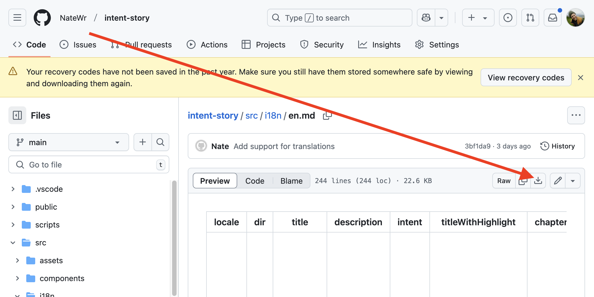

## Translation

To translate this story, download a copy of the [English translation](https://github.com/NateWr/intent-story/blob/main/src/i18n/en.md), by clicking the link and then clicking the download button indicated in the image below.



Open the file in a plain text editor like [Notepad](https://apps.microsoft.com/detail/9msmlrh6lzf3) or [VSCode](https://code.visualstudio.com/). Avoid using Microsoft Word or Google Docs, if possible, because these programs add formatting that we can not use.

When you open the file in a plain text editor, it should look like this:

```
---
locale: en
dir: ltr
title: The Road to Genocide
description: How incitement from Israeli leaders led directly and deliberately to the continuing genocide of Palestinians in Gaza.
intent: Intent
titleWithHighlight: the road to <strong>genocide</strong>
chapters: Chapters
...
```

Each line has a unique `name` that appears before the `:`. This part should never be changed. When translating, only translate the text after the `:`. For example, given the following line:

```
title: The Road to Genocide
```

The Arabic translation would look like this:

```
title: الطريق إلى الإبادة الجماعية
```

Some of the text has markup that appears between `<` and `>` symbols. When translating, don't translate the text inside of these. For example, given the following line:

```
titleWithHighlight: the road to <strong>genocide</strong>
```

The Arabic translation would look like this:

```
titleWithHighlight: الطريق إلى <strong>الإبادة الجماعية</strong>
```

It's important that the translation is about the same length as the original text. If the translation is much longer than the original text, it may not fit on the screen. Follow these recommendations:

* When translating a **quote**, please make sure the translation is as close as possible in meaning to the original, even if the length is not consistent. We will adapt this as necessary.
* When translating **narrative text**, rephrase as needed to prevent the translation from being too long. Instead focus on preserving the meaning and tone of the original.

Once you share your translation, we will test it out and let you know if there is a problem with the length of any translation. You can recommend an alternate translation.
